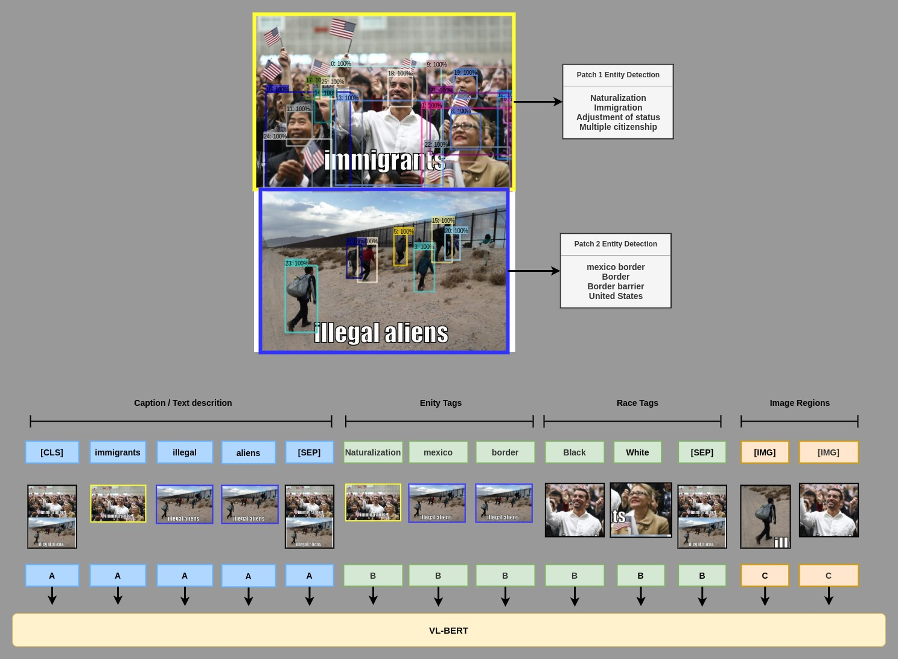

# VL-BERT



This section contained the code needed to train and inference modify version of VL-BERT that will be trained from the pretrained weight provide in [offiical repo](https://github.com/jackroos/VL-BERT).

## Prerequirements

Before we run the trianing script, we should first download and unzip the [pretrained weight](https://drive.google.com/file/d/15IAT7NVCXtTj_9itl7OXtA_jXRwiaVWZ/view?usp=sharing) to ``ROOT/pretrain_model``. After you do so, your project folder should look somehting like this

```bash
HatefulMemes
├── VL-BERT
├── data
├── data_utils
├── pretrain_model
│   ├── ...
│   └── vl-bert
│       ├── bert-base-uncased
│       │   ├── bert_config.json
│       │   ├── pytorch_model.bin
│       │   └── vocab.txt
│       ├── bert-large-uncased
│       │   ├── bert_config.json
│       │   ├── pytorch_model.bin
│       │   └── vocab.txt
│       ├── resnet101-pt-vgbua-0000.model
│       ├── vl-bert-large-e2e.model
│       └── vl-bert-base-e2e.model
└── test
```

**Please make sure you already done [the data preprcessing step](../data_utils/REAME.md), and place the training/test data in the right path!**

## Fine-tune on HatefulMeme

You can train the VL-BERT used in the competition by runing shell script:

```bash
bash run_train.sh
```

This will first compile RoI pooling cuda op, then start the training of:

* VL-BERT base with entity tag
* VL-BERT large with entity tag
* VL-BERT large with entity tag, race tag and multi-sample dorpout

Base model will take 1 hour to train, and large one will take about 2 hours.

After script is finshed. you shoulde see something like this in `ROOT/checkpoints`

```bash
.
├── ERNIE-Vil
├── UNITER
├── VL-BERT
├── data
├── data_utils
├── pretrain_model
└── checkpoints
    ├── ernie-vil
    ├── uniter
    └── vl-bert
        ├── vl-bert-base-v4
        │   ├── base_4x14G_fp32_k8s_v4_cls_test.csv
        │   ├── base_4x14G_fp32_k8s_v4_cls_test.json
        │   └── vl-bert_base_res101_cls_test_ckpt_MEME.model
        ├── vl-bert-large-v4
        │   ├── large_4x14G_fp32_k8s_v4_cls_test.csv
        │   ├── large_4x14G_fp32_k8s_v4_cls_test.json
        │   └── vl-bert_large_res101_cls_test_ckpt_MEME.model
        └── vl-bert-large-v5-race
            ├── large_4x14G_fp32_k8s_v5_race_cls_test.csv
            ├── large_4x14G_fp32_k8s_v5_race_cls_test.json
            └── vl-bert_large_res101_cls_test_ckpt_MEME.model
```

## Rerun test set inference

```bash
bash rerun_test.sh
```

By runing this script it will use every checkpoint with the pattern `vl-bert_{base/large}_res101_cls_test_ckpt_MEME.model` in the path `ROOT/checkpoints/vl-bert/**/`. And the csv inference results will also be updated. This could be useful when you are directly working with the [fine-tuned checkpoints](https://drive.google.com/file/d/1ef_2xX8ZcDJQecPJbufntWyuUL0nY0E7/view?usp=sharing).