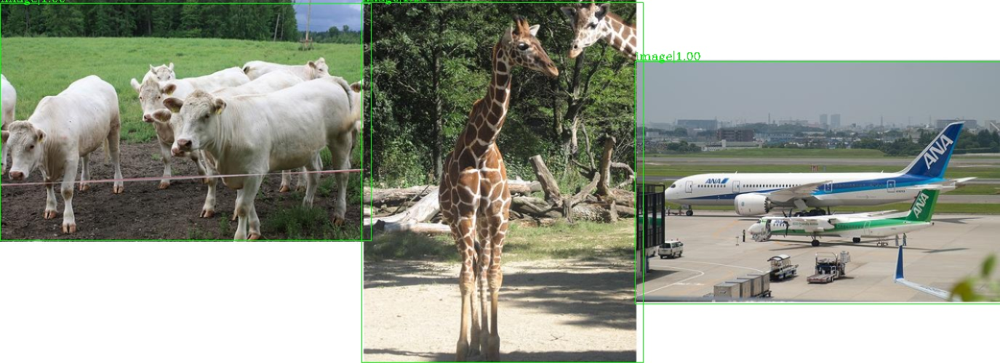
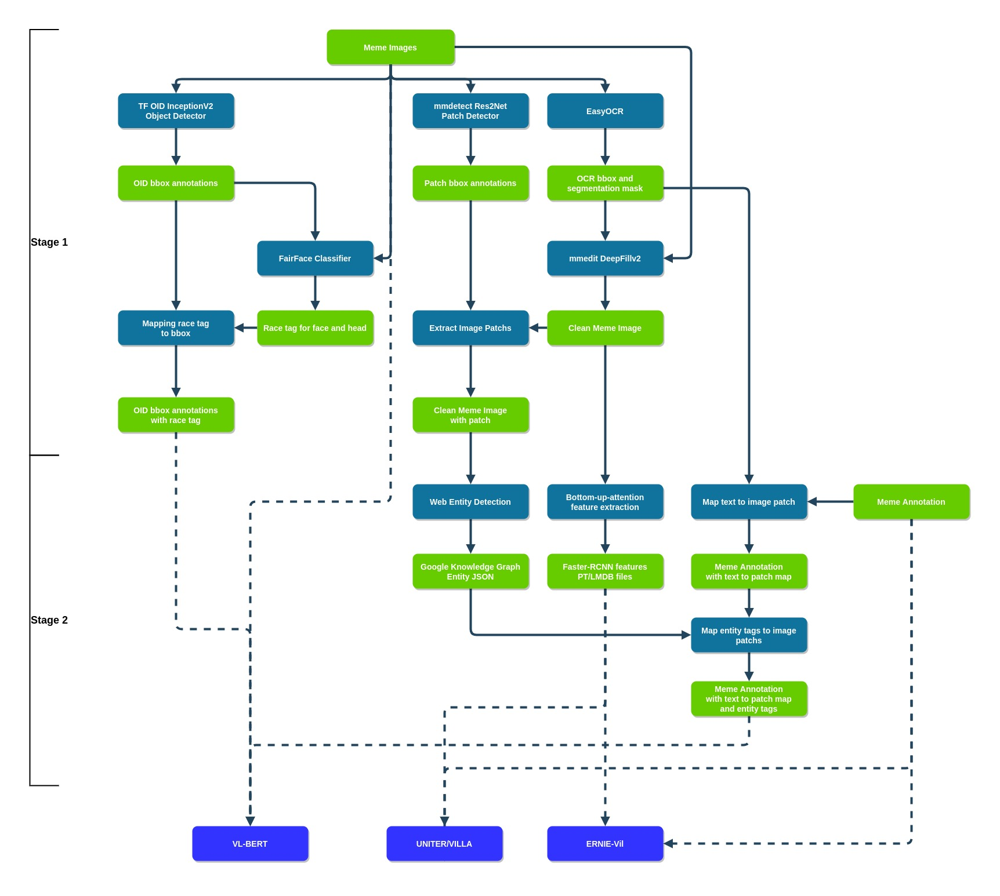

# Data Preprocessing

## Pretrained Models

 model                     | source/framework    | usage                     | download link  |
| ------------------------ |:-------------------|:------------------------- | :------------- |
| Res2Net Patch Detector | [mmdetection](https://github.com/HimariO/mmediting)/pytorch | extract image patch       | [link](https://drive.google.com/file/d/1fWZzMt8BQjWffeKSqU7PZTpGLR22LMjI/view?usp=sharing) |
| DeepFillV2             | [mmediting](https://github.com/HimariO/mmediting)/pytorch   | remove text from meme image | [link](https://download.openmmlab.com/mmediting/inpainting/deepfillv2/deepfillv2_256x256_8x2_places_20200619-10d15793.pth) |
| InceptionV2 OID        | [tf-hub](https://tfhub.dev/google/faster_rcnn/openimages_v4/inception_resnet_v2/1)/tensorflow          | extract meme image bbox        | auto download |
| FairFace Classifier    | [fairface](https://github.com/HimariO/FairFace)/pytorch           | classifiy race of face/head detect by InceptionV2 | link is in the repo |
| VisualGnome FasterRCNN | [py-bottom-up-attention](https://github.com/HimariO/py-bottom-up-attention)/pytorch | extract RoI feature from inpainted image   | auto download |

### Image Patch Detector


Some of the memes are compose by multiple image(patch), and offen the meaning of the meme will different depend on which text located on which image patch. So I trained a imgae patch detector with off-the-shelf faster-rcnn detector provide by mmdetection and training data generated by random stick togehter 2~3 images from [GQA](https://cs.stanford.edu/people/dorarad/gqa/index.html). Script and config that train the model and generating the dataset could be found in repo linked in the table above.

**NOTE:** If you want to repoduce the original competetion result, you should use the [pretrined model](https://drive.google.com/file/d/1fWZzMt8BQjWffeKSqU7PZTpGLR22LMjI/view?usp=sharing) sinece both the training and dataset generating process are not deterministic.

## Preprocess Steps



Data processing flow is dived into two stage. First stage detecting objects & text and creating clean images. Second stage utilze those infomation to extract more feature from image and integrade the extra feature into original meme annotation.

### Prerequirements

We first should download and unzip the facebook hateful meme data to ``ROOT/data``. And we also need to download pretrain models to ``ROOT/pretrain_model``. After doing all that your project structure now should look like:

```bash
.
├── VL-BERT
├── data
│   └── hateful_memes
│       ├── LICENSE.txt
│       ├── README.md
│       ├── dev_seen.jsonl
│       ├── dev_unseen.jsonl
│       ├── img
│       ├── test_seen.jsonl
│       ├── test_unseen.jsonl
│       └── train.jsonl
├── data_utils
├── pretrain_model
│   ├── deepfillv2_256x256_8x2_places_20200619-10d15793.pth
│   └── faster_rcnn_r2_101_fpn_2x_img_clip
│       ├── epoch_1.pth
│       ├── epoch_2.pth
│       ├── epoch_3.pth
│       ├── faster_rcnn_r2_101_fpn_2x_img_clip.py
│       └── latest.pth
└── test
```

### Shortcut

If you want to go straight to model training, you can download pre-builded data from here:\
[meme annotation with entity and box annotation with race tag](https://drive.google.com/file/d/1NTaDqL2hPFGRZywBqDwkUBVfOq_0DMDy/view?usp=sharing)\
[image feature pt file for ernie-vil](https://drive.google.com/file/d/1OG-toHeDtQeBsP2lSIgKgWQWhDStNnFw/view?usp=sharing)\
[image feature npz file for untier](https://drive.google.com/file/d/1qggKh_yi-MotapCMEiAZ--Yha-pHqbzR/view?usp=sharing)\
And you can find out where to put those files  in the following sections.

### Frist Stage

1. OCR
2. Image Inpainting
3. Get OID bbox
4. Face detection and human race classification

```bash
# data/hateful_memes/img
#    --> data/hateful_memes/img_clean
#    --> data/hateful_memes/box_annos.race.json
#    --> data/hateful_memes/split_img_clean
#    --> data/hateful_memes/split_img_clean_boxes.json
bash run_all.sh
```

After the first stage your data folder should look like:

```bash
.
├── VL-BERT
├── data
│   ├── hateful_memes
│   │   ├── img
│   │   ├── img_clean   # img with text removed
│   │   ├── img_mask_3px  # text mask used in removing text using DeepFillV2
│   │   ├── split_img_clean   # if meme image is compose by multiple patches, it will be break down and store to here
│   │   ├── split_img_clean_boxes.json  # results of image patche detection
│   │   ├── box_annos.json  # OID V4 object detection result
│   │   ├── box_annos.race.json  # same as box_annos.json but with race and gender tags attach to bbox
│   │   ├── face_race_boxes.json  # race and gender tags
│   │   ├── ocr.json   # raw EasyOCR detction result
│   │   └── ocr.box.json   # same EasyOCR detction result but in bbox format
│   └── ...
└── ...
```

### Second Stage

1. Extract RoI feature

    ```bash
    # data/hateful_memes/img_clean 
    #    --> data/hateful_memes/hateful_memes_v2*.pt
    #    --> data/uniter/MEME_NPZ_CLEAN
    bash run_extract_feat.sh
    ```

2. Web Entity Detection\
**NOTE:** If you want to reproduce the original experiment or don't have access to GCP service you could just download the detection results from [link](https://drive.google.com/file/d/1JPQA1jcmfDYkEK_89U_UP-VtyUrTwJKi/view?usp=sharing) and place it under ``ROOT/data``. If your want to generate new web entity result for new dataset, follow this [guide](https://cloud.google.com/vision/docs/internet-detection) to setup gcloud enviorment.

    ```bash
    bash run_web_det.sh
    ```

3. Insert extra feature into annotations

    ```bash
    bash run_anno_preocessing.sh
    ```

After the second stage your data folder should look like:

```bash
.
├── VL-BERT
├── data
│   ├── uniter
│   │   └── MEME_NPZ  # img feature for uniter
│   ├── hateful_memes
│   │   ├── LICENSE.txt
│   │   ├── img
│   │   ├── img_clean
│   │   ├── README.md
│   │   ├── hateful_boxes_attr.json
│   │   ├── hateful_memes_v2.pt        # img feature for ernie-vil
│   │   ├── hateful_memes_v2.aug.0.pt  # img feature for ernie-vil
│   │   ├── hateful_memes_v2.aug.1.pt  # img feature for ernie-vil
│   │   ├── hateful_memes_v2.aug.2.pt  # img feature for ernie-vil
│   │   ├── dev_seen.entity.jsonl
│   │   ├── dev_unseen.entity.jsonl
│   │   ├── test_seen.entity.jsonl
│   │   ├── test_unseen.entity.jsonl
│   │   ├── train_dev_all.entity.jsonl
│   │   └── train.entity.jsonl
│   └── entity_json   # web entity detection
│       ├── 05819.json
│       ├── ...
│       ├── 01236.0.json
│       └── 01236.1.json
└── ...
```

JSONl files with ``.eniity.jsonl`` extentions are the final output we will using to train the modified VL-BERT in the next step.